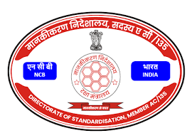

<div align="center">



# 🛡️ Defence Standardisation — Codification Intelligence System

**Advanced NSN Codification Management & Reporting Platform**

*Directorate of Standardisation, Bengaluru — Member AC/135*
*Ministry of Defence, Government of India*

---


[Overview](#-overview) · [Features](#-features) · [Installation](#-installation) · [Usage](#-how-to-use) · [Dataset Format](#-dataset-format) · [Tech Stack](#-tech-stack) · [Team](#-team)

</div>

---

## 📌 Overview

The **DS Codification Intelligence System** is a secure, fully offline web application built for the **Directorate of Standardisation, Bengaluru (Member AC/135)**. It automates the management, analysis, and monthly reporting of NSN (NATO Stock Number) codification data submitted by DPSUs (Defence Public Sector Undertakings) and AHSPs (Army HQ Sponsored Programmes).

The system converts raw Excel codification datasets into professional, submission-ready monthly reports — featuring live KPI dashboards, DPSU-wise analytics, interactive charts, and officially formatted Excel exports.

> ⚠️ **For authorised Defence personnel only. Unauthorised access is strictly prohibited.**

---

## 👨‍💻 Team

This project was collaboratively built by the **Cobra Tech** team from **ABVGIET Shimla** for the Directorate of Standardisation, Bengaluru.

<div align="center">

| Member | Role | GitHub |
|---|---|---|
| **Jahnavi Kaur** | Developer | [](https://github.com/jahnavikaur) |
| **Nikhil Rajput** | Developer | [](https://github.com/nickrajput716) |

</div>

---

## ✨ Features

| Feature | Description |
|---|---|
| 📂 **Multi-File Upload** | Upload one or multiple `.xlsx` / `.xls` datasets at once with drag-and-drop support |
| 🧠 **Intelligent Data Analysis** | Auto-detects headers, validates data, and computes DPSU/NCB/Equipment breakdowns |
| 📊 **Interactive Charts** | 6 Chart.js visualisations per file: DPSU doughnut, status pie, forwarding, NSN allotment, returns, and pending |
| 📅 **Per-File Report Periods** | Set a separate month and year for each uploaded file independently |
| 📁 **Professional Excel Export** | Fully styled `.xlsx` reports with official headers, DS Cell logo, colour-coded KPIs, grand totals, and signature blocks |
| 🌗 **Dark & Light Mode** | Full theme support with preference saved in `localStorage` |
| 🔒 **Offline Operation** | No internet required; all processing and data stays on your machine |
| 🕑 **Session History** | All reports generated in a session are tracked with one-click download links |
| 🗃️ **Pre-loaded Dataset** | Use the bundled training dataset without uploading anything |

---

## 📁 Project Structure

```
ds-codification-system/
│
├── app.py                    # Flask application, routes, DataEngine, Excel builder
├── report_generator.py       # Core report data extraction logic
├── requirements.txt          # Python dependencies
│
├── data/
│   └── final_dataset_.xlsx   # Pre-loaded training dataset (optional)
│
├── static/
│   └── img/
│       └── logo.png          # DS Cell official logo
│
├── templates/
│   ├── index.html            # Landing / home page
│   ├── dashboard.html        # Main 4-step dashboard (upload → analyze → generate → history)
│   └── report.html           # Legacy single-report HTML view
│
├── uploads/                  # Uploaded Excel files (auto-created at runtime)
└── reports/                  # Generated Excel reports (auto-created at runtime)
```

---

## ⚙️ Prerequisites

- Python **3.8** or higher
- `pip` (Python package manager)
- A modern web browser (Chrome, Firefox, or Edge recommended)

---

## 🚀 Installation

**1. Clone the repository**

```bash
git clone https://github.com/your-username/ds-codification-system.git
cd ds-codification-system
```

**2. Create and activate a virtual environment** *(recommended)*

```bash
python -m venv venv

# Windows
venv\Scripts\activate

# macOS / Linux
source venv/bin/activate
```

**3. Install dependencies**

```bash
pip install -r requirements.txt
```

**4. Add the DS Cell logo**

Place the official logo at:
```
static/img/logo.png
```

**5. Add the training dataset** *(optional)*

Place your pre-loaded Excel file at:
```
data/final_dataset_.xlsx
```

---

## ▶️ Running the App

```bash
python app.py
```

Then open your browser and navigate to:

```
http://localhost:5000
```

---

## 🖥️ How to Use

The dashboard follows a clean **4-step workflow**:

### Step 1 — Upload Dataset
- Drag & drop `.xlsx` / `.xls` files onto the upload zone, or click **Choose Files**
- Upload multiple files to generate separate reports for each
- Or click **Use Pre-loaded Training Dataset** to skip uploading

### Step 2 — Analyze Data
- Click **Next: Analyze Data**
- Each file gets its own tab showing:
  - KPI strip (Total Items, Forwarded, NSN Allotted, Returned, Pending)
  - DPSU distribution bar chart
  - Service-wise (NCB) breakdown
  - Top 10 equipment types
  - 6 interactive Chart.js graphs

### Step 3 — Generate Reports
- Set the **Month** and **Year** for each file individually
- Click **⚡ Generate All Reports**
- Each file produces an in-page HTML table and a downloadable Excel report

### Step 4 — Report History
- All reports generated in the session are listed with filename, source, period, and timestamp
- One-click download for any previous report

---

## 📊 Dataset Format

Your Excel file must contain a header row with the following columns:

| Column | Description |
|---|---|
| `DPSU` | Name of the DPSU / AsHSP organisation |
| `Equipment_Name` | Name of the equipment being codified |
| `Received_Date` | Date the item was received (DD/MM/YYYY) |
| `Forward_Date` | Date forwarded to DCA |
| `Return_Date` | Date returned to AHSP / DPSU |
| `NSN` | NSN number (if allotted) |
| `NSN_Allotment_Date` | Date of NSN allotment |
| `NCB` | Service designation (Army / Navy / Air Force) |
| `MRC` | MRC value (numeric) |

> The system auto-detects the header row position, so leading metadata rows in the Excel file are handled gracefully.

---

## 📄 Report Output

Each generated Excel report includes:

**Sheet 1 — Codification Summary**
- Official letterhead (Govt. of India / Ministry of Defence / Directorate of Standardisation)
- KPI banner (Total Items, Forwarded, NSN Allotted, Returned, Pending)
- Equipment-wise progress table grouped by DPSU
- Grand Total row
- Prepared By / Checked By / Approved By signature blocks

**Sheet 2 — DPSU Analysis**
- DPSU-wise breakdown with NSN allotted, returned, and pending counts

All reports are saved in the `reports/` directory and available for immediate download.

---

## 🛠️ Tech Stack

| Layer | Technology |
|---|---|
| Backend | Python 3, Flask |
| Data Processing | Pandas, NumPy |
| Excel Generation | OpenPyXL |
| Frontend | HTML5, CSS3 (custom dark/light theming), Vanilla JS |
| Charts | Chart.js |
| Fonts | Google Fonts — Orbitron, Rajdhani, Exo 2 |

---

## 📦 Dependencies

```
Flask==3.1.3
numpy==2.4.4
openpyxl==3.1.5
pandas==3.0.2
```

Install all with:

```bash
pip install -r requirements.txt
```

---

## 🔒 Security & Privacy

- The application runs **entirely offline** — no data is sent to any external server
- All uploaded files and generated reports are stored locally in `uploads/` and `reports/`
- Intended strictly for use on secure, authorised Defence networks

---

## 📃 License

This project is developed for **official Defence use only**.
Unauthorised copying, distribution, or deployment is strictly prohibited.

© 2026 Directorate of Standardisation, Ministry of Defence, Govt. of India

---

<div align="center">

**रक्षा मंत्रालय · भारत सरकार**
*Ministry of Defence · Government of India*

<sub>Developed by Cobra Tech, ABVGIET Shimla</sub>

</div>
